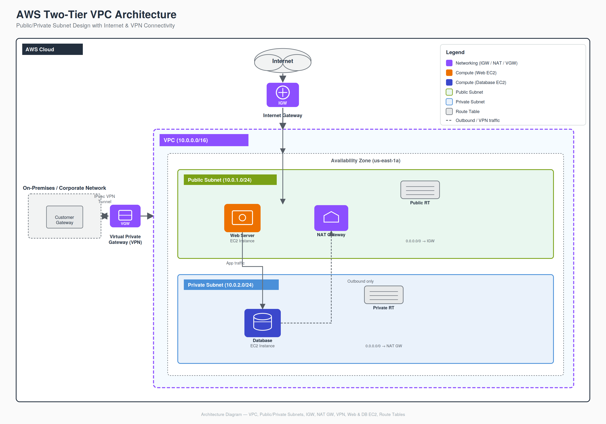
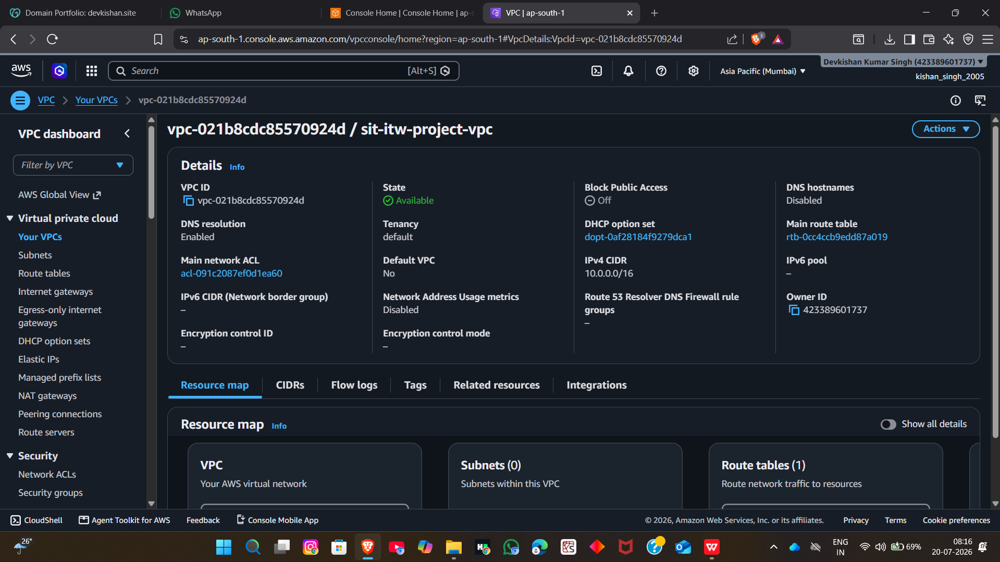
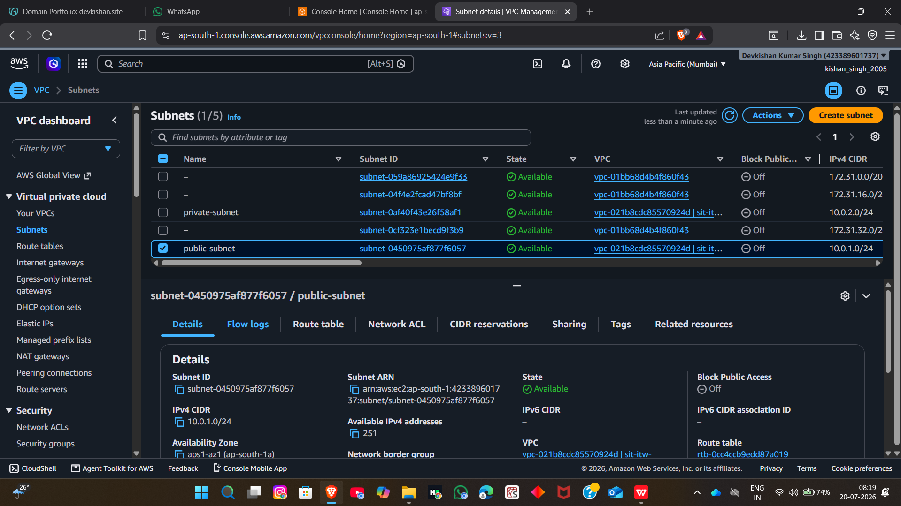
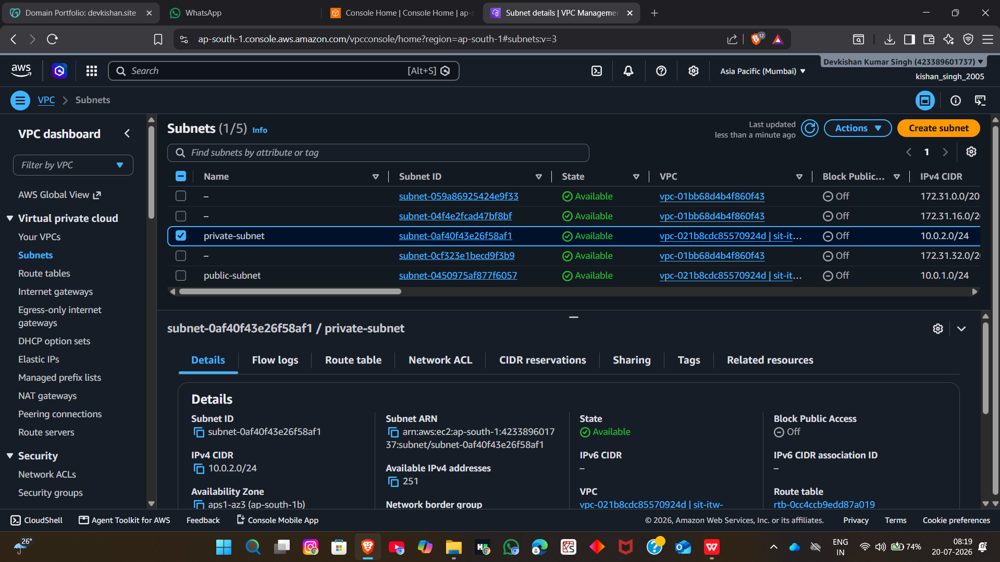
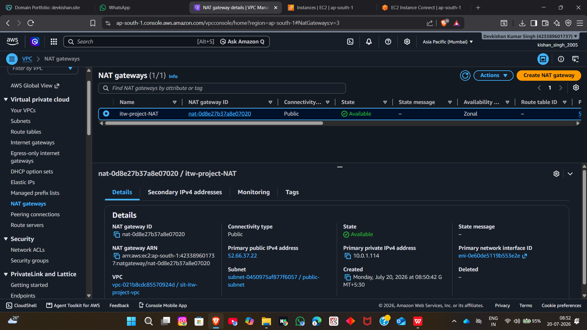
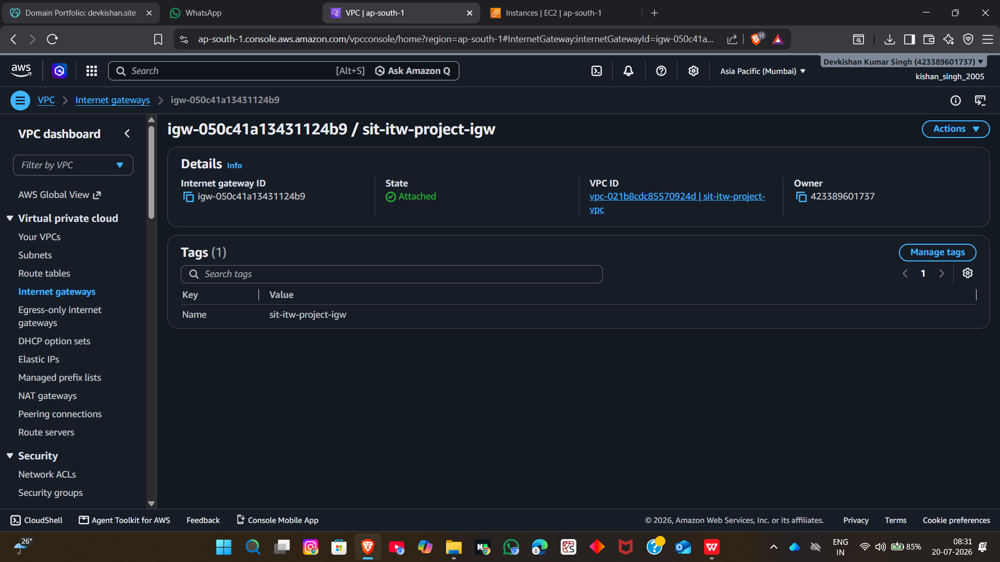
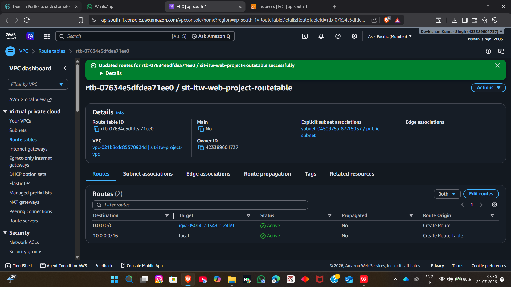
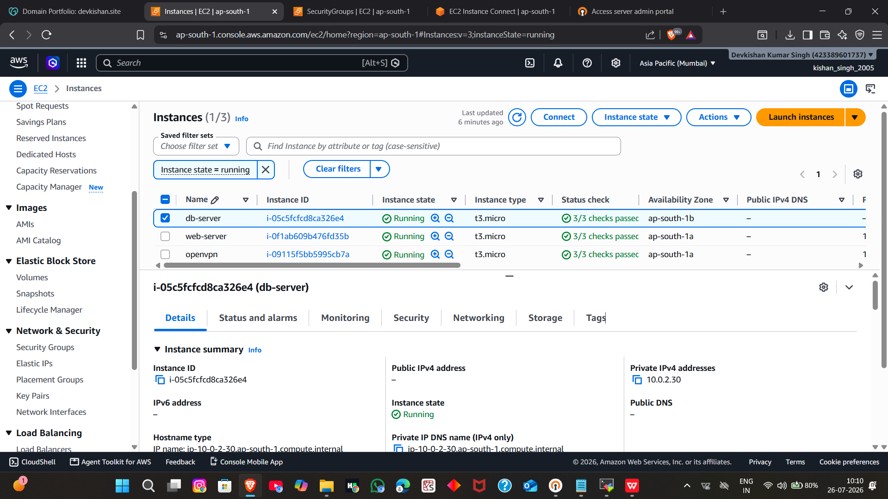
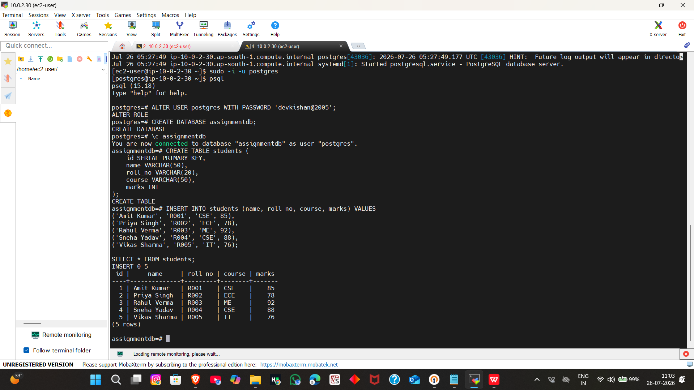

# Secure AWS Web Hosting with Private Database

## Overview

This project demonstrates a secure AWS cloud infrastructure architecture using Amazon VPC, public and private subnets, NAT Gateway, Internet Gateway, VPN connectivity, and database isolation.

The goal is to host a web application securely while protecting backend resources from direct internet exposure.

## AWS Services Used

- Amazon VPC
- EC2
- NAT Gateway
- Internet Gateway
- VPN
- Security Groups
- Route Tables
- MySQL Database

## Architecture Highlights

- Public subnet for web/application resources
- Private subnet for database resources
- Secure database isolation
- Controlled traffic using Security Groups
- NAT Gateway for outbound internet access
- VPN-based secure administrative access

## Project Documentation

- AWS_Project_Report.pdf
- Documentation_Part.pdf

## Architecture Diagram

# Project Screenshots

## VPC Configuration

## Public Subnet

## Private Subnet

## NAT Gateway

## Internet Gateway

## Route Table

## EC2 Instance

## Database Tables

## Security Group (Inbound Rules)

.png)

## Security Group (Outbound Rules)

.png)

## Author

Devekishan Kumar Singh

B.Tech CSE Student

AWS & Cloud Computing Enthusiast
